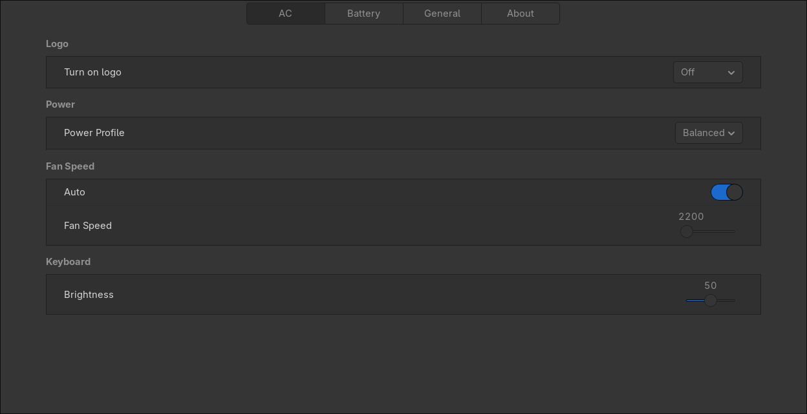

# Razer Laptop Control
An application designed for Razer laptops (excluding 2025 models)



## Features
- Full background daemon: Auto-loads last configuration on system startup
- CLI and GUI for adjusting settings
- RGB keyboard control
- Fan speed control
- Power mode management
- Battery optimization
- Logo state control (for models with logo)
- Light effect synchronization between AC/Battery modes

## Installation

### Binary Install
> [!WARNING]
> Tested on Arch Linux only

Using curl:
```nix
curl -sSL https://raw.githubusercontent.com/Solessfir/razer-laptop-control/main/install-bin.sh | bash -s install
```
Using wget:
```nix
wget -qO- https://raw.githubusercontent.com/Solessfir/razer-laptop-control/main/install-bin.sh | bash -s install
```

## Building from Source
Dependencies:
```sh
libdbus-1-dev libusb-dev libhidapi-dev libhidapi-hidraw0 pkg-config libudev-dev libgtk-3-dev
```
Steps:
1. Install Rust (cargo/rustc)
2. Install required dependencies
3. Run installer as normal user: `./razer_control_gui/install.sh install`
4. Reboot

## NixOS Flake Installation
1. Add to your flake inputs:
```nix
inputs.razerdaemon.url = "github:JosuGZ/razer-laptop-control";
```
2. Import module:
```nix
imports = [ inputs.razerdaemon.nixosModules.default ];
```
3. Enable service:
```nix
services.razer-laptop-control.enable = true;
```

## Uninstall
> [!WARNING]
> Tested on Arch Linux only

Using curl:
```nix
curl -sSL https://raw.githubusercontent.com/Solessfir/razer-laptop-control/main/install-bin.sh | bash -s uninstall
```
Using wget:
```nix
wget -qO- https://raw.githubusercontent.com/Solessfir/razer-laptop-control/main/install-bin.sh | bash -s uninstall
```

## CLI Usage
```nix
razer-cli <action> <attribute> <power_state> <args>
```

## Basic Examples
Set Balanced Power Mode:
```nix
razer-cli write power ac 0 1 0
```
Set Gaming Power Mode:
```nix
razer-cli write power ac 1 1 0
```
Set Static Red Keyboard:
```nix
razer-cli effect static 255 0 0
```
Available effects:
* `off` - No lighting
* `wave` - Direction parameter
* `reactive` - Speed, R, G, B
* `breathing` - Type, [RGB1], [RGB2]
* `spectrum` - Color cycle
* `static` - R, G, B
* `starlight` - Type, [RGB1], [RGB2]

## Advanced Usage
Power Control:

Custom power mode with CPU/GPU boost levels:
```nix
razer-cli write power ac 4 <cpu_boost> <gpu_boost>
```
Boost levels:
* 0 = Low
* 1 = Normal
* 2 = High
* 3 = Boost (CPU only on 2020+/Studio models)

## Command Structure
Actions:
* `read` - Check current state
* `write` - Change and save configuration

Attributes:
* `fan` - RPM (0=Auto, other=manual RPM)
* `power` - Mode (0=Balanced, 1=Gaming, 2=Creator, 4=Custom)
* `brightness` - Keyboard brightness (0-255)
* `logo` - Logo state (0=Off, 1=On, 2=Breathing)
* `sync` - Light sync between AC/battery
* `standard_effect` - Predefined keyboard effects
* `colour` - RGB values (0-255 per channel)

## [Join the Unofficial Razer Linux Channel](https://discord.gg/GdHKf45)
