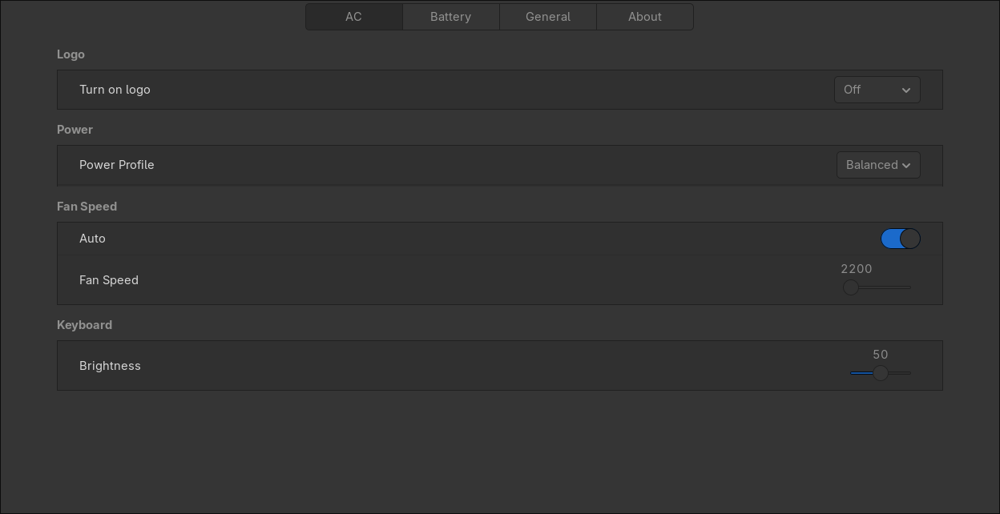

# Razer Laptop Control
An application designed for Razer laptops



## Features
- Full background daemon: Auto-loads last configuration on system startup
- CLI and GUI for adjusting settings
- RGB keyboard control
- Fan speed control
- Power mode management
- Battery optimization
- Logo state control (for models with logo)
- Light effect synchronization between AC/Battery modes

## Installation

### Binary Install
> [!WARNING]
> Tested on Arch Linux only

Using curl:
```nix
curl -sSL https://raw.githubusercontent.com/Solessfir/razer-laptop-control/main/install-bin.sh | bash -s install
```
Using wget:
```nix
wget -qO- https://raw.githubusercontent.com/Solessfir/razer-laptop-control/main/install-bin.sh | bash -s install
```

## Building from Source
Dependencies:
```sh
libdbus-1-dev libusb-dev libhidapi-dev libhidapi-hidraw0 pkg-config libudev-dev libgtk-3-dev
```
Steps:
1. Install Rust (cargo/rustc)
2. Install required dependencies
3. Run installer as normal user: `./install-bin.sh install_local`
4. Reboot

> [!NOTE]
> Running `install` or `install_local` again will reinstall over an existing installation.

## NixOS Flake Installation
1. Add to your flake inputs:
```nix
inputs.razer-laptop-control.url = "github:Solessfir/razer-laptop-control";
```
2. Import module:
```nix
imports = [ inputs.razer-laptop-control.nixosModules.default ];
```
3. Enable service:
```nix
services.razer-laptop-control.enable = true;
```

## Uninstall
> [!WARNING]
> Tested on Arch Linux only

Using curl:
```nix
curl -sSL https://raw.githubusercontent.com/Solessfir/razer-laptop-control/main/install-bin.sh | bash -s uninstall
```
Using wget:
```nix
wget -qO- https://raw.githubusercontent.com/Solessfir/razer-laptop-control/main/install-bin.sh | bash -s uninstall
```

## CLI Usage
```nix
razer-cli <action> <attribute> <power_state> <args>
```

## Basic Examples
Set Balanced Power Mode:
```sh
razer-cli write power ac 0
```
Set Gaming Power Mode:
```sh
razer-cli write power ac 1
```
Set Silent Power Mode:
```sh
razer-cli write power ac 3
```
Set Static Red Keyboard:
```sh
razer-cli effect static 255 0 0
```

## Power Modes
| Value | Mode |
|-------|------|
| 0 | Balanced |
| 1 | Gaming |
| 2 | Creator |
| 3 | Silent |
| 4 | Custom (requires cpu\_boost and gpu\_boost) |

Custom mode with CPU/GPU boost:
```sh
razer-cli write power ac 4 <cpu_boost> <gpu_boost>
```
CPU boost levels:
* 0 = Low
* 1 = Normal
* 2 = High
* 3 = Boost (only on models with `boost` feature)

GPU boost levels:
* 0 = Low
* 1 = Normal
* 2 = High

## Keyboard Effects

### Standard effects (firmware-side)
* `off` - No lighting
* `wave <direction>` - Direction: 0 or 1
* `spectrum` - Color cycle
* `static <r> <g> <b>` - Solid color
* `reactive <speed> <r> <g> <b>` - Speed: 0–255
* `breathing <kind> <r1> <g1> <b1> <r2> <g2> <b2>` - Kind: 0=single, 1=dual, 2=random
* `starlight <kind> <speed> <r1> <g1> <b1> <r2> <g2> <b2>` - Kind: 0=single, 1=dual, 2=random

### Custom per-key effects (animated)
```sh
razer-cli effect static <r> <g> <b>
razer-cli effect static-gradient <r1> <g1> <b1> <r2> <g2> <b2>
razer-cli effect wave-gradient <r1> <g1> <b1> <r2> <g2> <b2>
razer-cli effect breathing-single <r> <g> <b> <duration>
```

## Command Structure
Actions:
* `read` - Check current state
* `write` - Change and save configuration

Attributes:
* `fan` - RPM (0=Auto, other=manual RPM)
* `power` - Power mode (see Power Modes above)
* `brightness` - Keyboard brightness percentage (0–100)
* `logo` - Logo state (0=Off, 1=On, 2=Breathing)
* `sync` - Sync light settings between AC and battery profiles
* `bho` - Battery Health Optimization (`on`/`off` + optional threshold %)
* `light-control` - Enable/disable daemon lighting control (`on`/`off`)

> [!NOTE]
> Brightness changed via Fn keys is not saved by the daemon. Use `razer-cli write brightness` or the GUI to set a persistent value.

## [Join the Unofficial Razer Linux Channel](https://discord.gg/GdHKf45)
